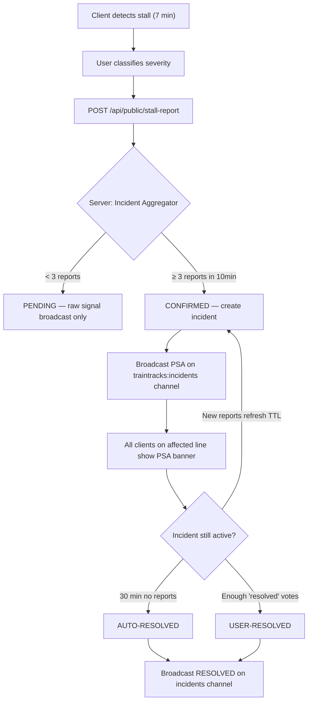

# Crowdsourced Stall Incident System

The current stall detection is solo — each phone detects its own stall and asks the user to classify it. But there's **no line-wide broadcast**, no moderation, no incident lifecycle. This plan adds a full **incident pipeline** with crowdsourced signals, quorum-based confirmation, line-wide PSAs, and automatic resolution.

## User Review Required

> [!IMPORTANT]
> **Quorum threshold**: I'm proposing **3 reports from 3 different devices within 10 minutes + 2km radius** to confirm an incident. Too low = false positives. Too high = slow confirmation. Is 3 right?

> [!IMPORTANT]
> **PSA duration**: Auto-expire after **30 minutes** unless refreshed by new reports. Should there be a manual "admin clear" option too?

> [!WARNING]
> **No persistent storage**: This uses in-memory incident state on the server. If the Vercel serverless function cold-starts, active incidents are lost. For production persistence, we'd need Supabase DB or KV store — but that's out of scope for now. Is in-memory acceptable?

## Open Questions

1. Should users be able to **vote to resolve** an incident? (e.g., "Trains moving again" button)
2. For the stall reason categories, is this list good? `slow_traffic | full_stop | door_issue | medical_emergency | power_outage | signal_fault | crowd_surge | unknown`
3. Should the PSA banner show on the **map view** too, or only as a bottom-sheet alert?

---

## Architecture: Incident Lifecycle



---

## Proposed Changes

### Domain: Incident Aggregator (Server-Side)

#### [NEW] [incidentAggregator.ts](file:///c:/Users/Exelec/Downloads/TrainTracks/src/domain/crowd/incidentAggregator.ts)

The core engine. In-memory store that:

- **Receives** stall reports from the API route
- **Clusters** reports by line + geo proximity (within 2km of each other)
- **Promotes** to `CONFIRMED` when quorum is met (3 unique devices, 10 min window)
- **Tracks** incident lifecycle: `PENDING → CONFIRMED → RESOLVED`
- **Auto-expires** incidents after 30 min with no new reports
- **Merges** overlapping incidents on the same line

```typescript
// Incident states
type IncidentStatus = 'PENDING' | 'CONFIRMED' | 'RESOLVED';

interface Incident {
    id: string;                          // INC-{lineId}-{timestamp}
    lineId: LineId;
    status: IncidentStatus;
    severity: 'traffic' | 'emergency';   // Worst severity from reports
    reason: StallReason;                 // Most common reason
    nearestStationId: string;
    nearestStationName: string;
    lat: number; lng: number;            // Centroid of reports
    reportCount: number;
    uniqueDevices: Set<string>;
    firstReportedAt: number;
    lastReportedAt: number;
    confirmedAt: number | null;
    resolvedAt: number | null;
    resolvedBy: 'auto_expired' | 'user_vote' | 'admin' | null;
    ttlMs: number;                       // 30 min default, refreshed by new reports
    resolveVotes: Set<string>;           // Device hashes that voted "resolved"
}

// Config (exposed in Config UI)
const INCIDENT_CONFIG = {
    quorumDevices: 3,          // Unique devices to confirm
    quorumWindowMs: 600_000,   // 10 minutes
    clusterRadiusKm: 2.0,     // Reports within 2km = same incident
    ttlMs: 1_800_000,         // 30 min auto-expire
    resolveQuorum: 3,          // 3 "resolved" votes to close
    maxActivePerLine: 3,       // Prevent flood
};
```

---

### API: Incident Endpoints

#### [MODIFY] [stall-report/route.ts](file:///c:/Users/Exelec/Downloads/TrainTracks/src/app/api/public/stall-report/route.ts)

**Current**: Validates + broadcasts raw report → done.

**New**: After broadcast, also **feeds the report into the IncidentAggregator**. If quorum is met, broadcasts a PSA on the `traintracks:incidents` channel.

Add fields to stall report payload:
- `reason`: `slow_traffic | full_stop | door_issue | medical_emergency | power_outage | signal_fault | crowd_surge | unknown`
- `message` (optional): Free-text user note, max 200 chars, sanitized

#### [NEW] [incidents/route.ts](file:///c:/Users/Exelec/Downloads/TrainTracks/src/app/api/public/incidents/route.ts)

```
GET /api/public/incidents?line=LRT1
```

Returns active incidents for a line (or all lines). Public, token-gated.

Response:
```json
{
    "ok": true,
    "incidents": [{
        "id": "INC-LRT1-1748450000000",
        "lineId": "LRT1",
        "status": "CONFIRMED",
        "severity": "emergency",
        "reason": "full_stop",
        "nearestStation": "PITX",
        "reportCount": 5,
        "uniqueDeviceCount": 4,
        "firstReportedAt": "2026-05-28T12:30:00Z",
        "confirmedAt": "2026-05-28T12:35:00Z",
        "expiresAt": "2026-05-28T13:05:00Z",
        "psa": "🚨 LRT-1 Service Disruption near PITX — Full stop reported by 4 commuters. Expect delays."
    }]
}
```

#### [NEW] [incidents/resolve/route.ts](file:///c:/Users/Exelec/Downloads/TrainTracks/src/app/api/public/incidents/resolve/route.ts)

```
POST /api/public/incidents/resolve
Body: { incidentId: "INC-LRT1-...", deviceId: "anon-device-xyz" }
```

Allows users to vote that the incident is resolved. When `resolveQuorum` is met, the incident moves to `RESOLVED` and a resolution PSA is broadcast.

---

### Broadcast: Supabase Realtime Channels

#### Channel: `traintracks:incidents`

| Event | When | Payload |
|-------|------|---------|
| `incident_confirmed` | Quorum met → new incident confirmed | Full incident object + PSA text |
| `incident_updated` | New reports on existing incident | Updated incident (report count, severity upgrade) |
| `incident_resolved` | TTL expired or user-voted resolved | Incident ID + resolution reason |

**Broadcast scope**: Line-wide. Every client subscribed to `traintracks:incidents` receives all incidents. Client-side filtering by `lineId` matches the user's current trip line.

---

### Client: PSA Banner Component

#### [NEW] [ServiceDisruptionBanner.tsx](file:///c:/Users/Exelec/Downloads/TrainTracks/src/components/ServiceDisruptionBanner.tsx)

A persistent **top-of-screen banner** (not a bottom sheet like stall/congestion alerts) that shows when there's a confirmed incident on the user's active line.

Design:
- **Red banner** for `emergency` severity
- **Amber banner** for `traffic` severity
- Sticky at top, below header
- Shows: incident description, station, report count, time since confirmed
- "Trains moving again?" button → calls resolve endpoint
- Auto-hides when incident is resolved (via Realtime)

```
┌──────────────────────────────────────────────────┐
│ 🚨 SERVICE DISRUPTION — LRT-1 near PITX         │
│ Full stop reported by 5 commuters • 12 min ago   │
│ [🟢 Trains moving again?]              [Dismiss] │
└──────────────────────────────────────────────────┘
```

#### [NEW] [useIncidentListener.ts](file:///c:/Users/Exelec/Downloads/TrainTracks/src/hooks/useIncidentListener.ts)

Hook that:
1. Subscribes to `traintracks:incidents` Supabase Realtime channel
2. Filters incidents by the user's `selectedLine` from trip store
3. Returns active incidents for the current line
4. Handles confirmed/updated/resolved events

---

### Client: Enhanced Stall Report UX

#### [MODIFY] [useStallDetector.ts](file:///c:/Users/Exelec/Downloads/TrainTracks/src/hooks/useStallDetector.ts)

After user confirms "Just Slow Traffic" or "Emergency Stop":
- Auto-POST to `/api/public/stall-report` with GPS location, severity, reason
- Show a brief "Report submitted" toast

#### [MODIFY] [StallAlert.tsx](file:///c:/Users/Exelec/Downloads/TrainTracks/src/components/StallAlert.tsx)

Add **reason picker** between the severity buttons:

```
┌──────────────────────────────────────────┐
│ ⚠️ Possible Disruption                   │
│ Your train hasn't moved for ~7 minutes.  │
│                                          │
│ What's happening?                        │
│ ┌────────┐ ┌────────┐ ┌────────┐        │
│ │🐌 Slow │ │🛑 Stop │ │🚪 Door │        │
│ │Traffic │ │       │ │ Issue  │        │
│ └────────┘ └────────┘ └────────┘        │
│ ┌────────┐ ┌────────┐ ┌────────┐        │
│ │🏥 Med. │ │⚡ Power│ │❓ IDK  │        │
│ │Emerg.  │ │Outage │ │       │        │
│ └────────┘ └────────┘ └────────┘        │
│                                          │
│ [Submit Report]                          │
│ Auto-dismisses in 15s                    │
└──────────────────────────────────────────┘
```

---

### Integration with Config & ApiConsole

#### [MODIFY] [ApiConsole.tsx](file:///c:/Users/Exelec/Downloads/TrainTracks/src/components/ApiConsole.tsx)

**Config tab**: Add "Incident Aggregator" section with quorum, TTL, cluster radius, resolve quorum settings.

**Live Stats tab**: Add "Active Incidents" card showing current confirmed incidents across all lines with status, report count, and time remaining.

#### [MODIFY] [ApiDocs.tsx](file:///c:/Users/Exelec/Downloads/TrainTracks/src/components/ApiDocs.tsx)

Add documentation for:
- `GET /api/public/incidents`
- `POST /api/public/incidents/resolve`
- Updated `POST /api/public/stall-report` (new `reason` + `message` fields)

---

## Summary: What Prevents Abuse

| Layer | Protection |
|-------|-----------|
| **Rate limiting** | 5 min cooldown per device, 6/hour cap |
| **Geo-fence** | Metro Manila bounds + 1.5km from nearest station |
| **Quorum** | 3 unique devices must independently report before PSA fires |
| **Proximity clustering** | Reports must be within 2km of each other to count as same incident |
| **TTL auto-expire** | 30 min with no fresh reports → auto-resolved |
| **Service hours** | No reports during closed hours (23:00–04:30) |
| **Device hashing** | Privacy-first — device IDs hashed, no PII stored |
| **Resolve voting** | 3 users can vote "resolved" to clear false alarms |
| **Per-line cap** | Max 3 active incidents per line (prevents flood) |

---

## Verification Plan

### Automated Tests
- Build check (`npx next build`)
- `curl` test all new endpoints: `/incidents`, `/incidents/resolve`
- `curl` test updated `/stall-report` with `reason` + `message` fields

### Manual Verification
- Deploy to production
- Open two browser tabs on different "devices" → submit stall reports → verify quorum + PSA banner
- Verify auto-expire after TTL
- Verify resolve voting
